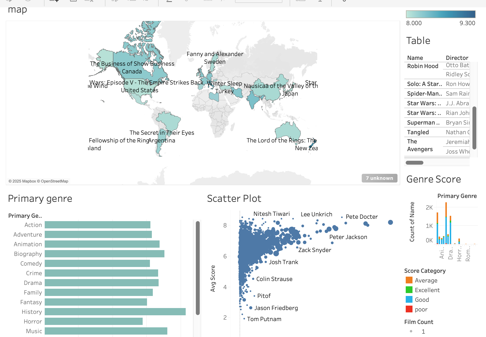

# 🎬 Tableau Movie Industry Dashboard

A data visualization project exploring trends in the movie industry using Tableau. This includes insights on IMDb scores, genre performance, director analytics, and vote distributions.

## 📊 Overview

This dashboard provides:

- **KPI Tiles**: Total movies, average IMDb score, % of excellent-rated films.
- **Genre Analysis**: Score vs. Genre, Genre vs. Movie Count.
- **Time Trends**: IMDb score trends over years.
- **Director Stats**: Most active and top-rated directors.
- **Popularity Metrics**: Vote distribution and scatterplots.
- **Geographical Insight**: World map of movie releases.
- **Story Format**: Walkthrough combining multiple dashboards.

## 📁 Files

- `movie_dashboard.pdf` – Exported PDF version of the Tableau story.
- `dashboard_preview.png` – Visual preview of the dashboard.

## 🧠 Insights

Some key findings include:

- Action and Drama dominate in movie count, but Drama holds higher average ratings.
- The most consistent period for high-rated movies was from 1994–2005.
- A few directors significantly outperform peers in average ratings.

## 📦 Dataset

This project uses publicly available movie data:

- 📂 Source: [IMDb Movie Dataset on Kaggle](# 🎬 Tableau Movie Industry Dashboard

A data visualization project exploring trends in the movie industry using Tableau. This includes insights on IMDb scores, genre performance, director analytics, and vote distributions.

## 📊 Overview

This dashboard provides:

- **KPI Tiles**: Total movies, average IMDb score, % of excellent-rated films.
- **Genre Analysis**: Score vs. Genre, Genre vs. Movie Count.
- **Time Trends**: IMDb score trends over years.
- **Director Stats**: Most active and top-rated directors.
- **Popularity Metrics**: Vote distribution and scatterplots.
- **Geographical Insight**: World map of movie releases.
- **Story Format**: Walkthrough combining multiple dashboards.

## 📁 Files

- `movie_dashboard.pdf` – Exported PDF version of the Tableau story.
- `dashboard_preview.png` – Visual preview of the dashboard.

## 🧠 Insights

Some key findings include:

- Action and Drama dominate in movie count, but Drama holds higher average ratings.
- The most consistent period for high-rated movies was from 1994–2005.
- A few directors significantly outperform peers in average ratings.

## 📦 Dataset

This project uses publicly available movie data:

- 📂 Source: [IMDb Movie Dataset on Kaggle](https://www.kaggle.com/datasets/PromptCloudHQ/imdb-data)

## 📎 How to View Full Dashboard

This is a static version. For interactive dashboards:

- You can view it on Tableau Public here *(insert link)*.
- Or open the `.twbx` file (not included here) in Tableau Desktop.

## 📜 License

This project is open-source under the MIT License.
)

## 📎 How to View Full Dashboard

This is a static version. For interactive dashboards:

- You can view it on Tableau Public here *(insert link)*.
- Or open the `.twbx` file (not included here) in Tableau Desktop.

## 📜 License

This project is open-source under the MIT License.
